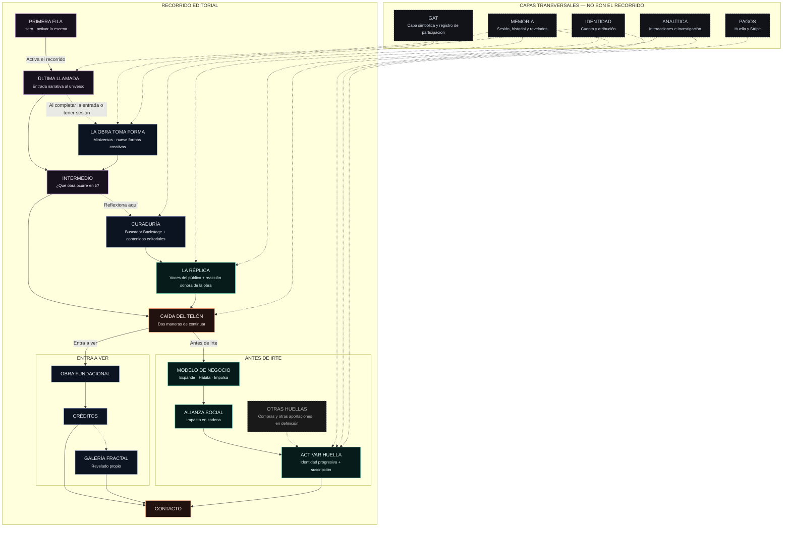

# Flujo actual del sitio — #GatoEncerrado

> Versión 6 · 19 de agosto de 2026  
> El recorrido editorial es la columna vertebral. Identidad, memoria, GAT, analítica y pagos son capas transversales; no etapas obligatorias del relato.

## Lectura del diagrama

- Las flechas continuas representan el recorrido editorial o el orden natural de lectura.
- Las flechas discontinuas representan revelados, condiciones o capas que intervienen sin convertirse en una etapa narrativa.
- La autenticación permite persistencia y ciertas interacciones, pero no divide el sitio entre una experiencia incompleta y otra completa.
- GAT dejó de ser una mecánica de engagement y se documenta como capa simbólica del sistema.
- “Otras huellas” permanece marcado como evolución pendiente para no presentar como terminado el futuro registro de compras u otras aportaciones.

## Subflujo técnico de La Réplica

```mermaid
flowchart LR
  VOZ[Voz elegida del público] --> MODO[Modo<br/>confusion-lucida]
  MODO --> API[POST<br/>/api/obra-conciencia]
  API --> RAG[RAG interno<br/>escenas · símbolos · emociones]
  RAG --> PROMPT[Conciencia de la obra<br/>reacciona, no resuelve]
  PROMPT --> TEXTO[Reacción textual]
  TEXTO --> TTS[Síntesis de voz]
  TTS --> AUDIO[Reacción sonora irrepetible]

  classDef entrada fill:#17111d,stroke:#ae8ac5,color:#f4edf8;
  classDef proceso fill:#0d1421,stroke:#7487aa,color:#f1f5fb;
  classDef salida fill:#071b1a,stroke:#58bca7,color:#eafff9;
  class VOZ,MODO entrada;
  class API,RAG,PROMPT,TEXTO proceso;
  class TTS,AUDIO salida;
```

## Fuente de verdad

- Orden de montaje y estados de revelado: `src/App.jsx`.
- Navegación editorial: `src/components/Header.jsx`.
- Miniversos y Alianza: `src/components/MiniverseInlineSection.jsx` y `src/components/MiniverseModal.jsx`.
- La Réplica: `src/components/About.jsx` y `src/hooks/useSilvestreVoice.js`.
- Reacción de la obra: `backend/gato-enigmatico-api/routes/obraConciencia.js`.
